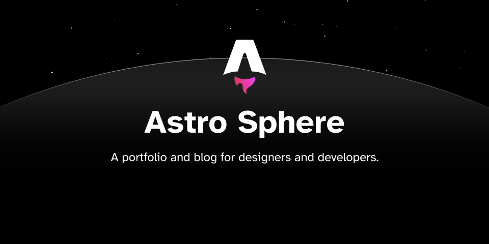

Astro Sphere is a static, minimalist, lightweight, lightning fast portfolio and blog theme based on my personal website.

It is primarily Astro, Tailwind and Typescript, with a very small amount of SolidJS for stateful components.

## 🚀 Deploy your own

  

## 📋 Features

- ✅ 100/100 Lighthouse performance
- ✅ Responsive
- ✅ Accessible
- ✅ SEO-friendly
- ✅ Typesafe
- ✅ Minimal style
- ✅ Light/Dark Theme
- ✅ Animated UI
- ✅ Tailwind styling
- ✅ Auto generated sitemap
- ✅ Auto generated RSS Feed
- ✅ Markdown support
- ✅ MDX Support (components in your markdown)
- ✅ Searchable content (posts and projects)
- ✅ Code Blocks - copy to clipboard

## 💯 Lighthouse score

## 🕊️ Lightweight
All pages under 100kb (including fonts)

## ⚡︎ Fast
Rendered in ~40ms on localhost

## 📄 Configuration

The blog posts on the demo serve as the documentation and configuration.

## 💻 Commands

All commands are run from the root of the project, from a terminal:

Replace pnpm with your package manager of choice. `pnpm`, `pnpm`, `yarn`, `bun`, etc

| Command                   | Action                                           |
| :------------------------ | :----------------------------------------------- |
| `pnpm install`             | Installs dependencies                            |
| `pnpm dev`             | Starts local dev server at `localhost:4321`      |
| `pnpm dev:network`     | Starts dev server on local network               |
| `pnpm sync`            | Generates TypeScript types for all Astro modules.|
| `pnpm build`           | Build your production site to `./dist/`          |
| `pnpm preview`         | Preview your build locally, before deploying     |
| `pnpm preview:network` | Starts preview server on local network           |
| `pnpm astro ...`       | Run CLI commands like `astro add`, `astro check` |
| `pnpm astro -- --help` | Get help using the Astro CLI                     |
| `pnpm lint`            | Run ESLint                                       |
| `pnpm lint:fix`        | Auto-fix ESLint issues                           |

## 🗺️ Roadmap

A few features I plan to implement
- ⬜ Article Pages - Table of Contents
- ⬜ Article Pages - Share on social media

## ✨ Acknowledgement

Theme inspired by [Paco Coursey](https://paco.me/), [Lee Robinson](https://leerob.io/) and [Hayden Bleasel](https://www.haydenbleasel.com/)

## 🏛️ License

MIT

# 1.0.1 Update

Added ability to run dev and preview on local network.
added pnpm dev:network
added pnpm preview:network

Added slightly more particle density in both light and dark mode.

Added subtle dark mode star and meteor animations.

Removed eslint config

